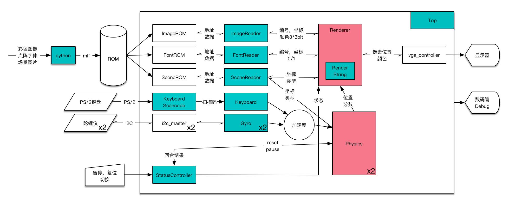

# 重力感应平衡球 项目报告

数字逻辑设计2017春 课程报告

小组成员：王润基、赵嘉霖

## 设计思路

主要分为读取模块、输入模块、逻辑模块、显示模块、顶层控制模块。

* 读取模块：根据外部请求，从ROM中读取数据，返回图片/文字/场景信息。
* 输入模块：处理键盘和重力传感器的信号，转换成加速度向量。
* 逻辑模块：处理物理计算，根据场景和球位置计算下一时刻的状态，实现球的加速、碰撞等等。
* 显示模块：负责输出画面。
* 顶层控制：负责统筹控制其他模块，进行参数传递，常量设置以及和rom的接口。

## 设计难点

* 重力传感器：

  由于重力传感器基于I2C协议，而网上关于I2C的VHDL代码又少之又少，所以调试过程非常艰辛。而且由于重力传感器与FPGA之间线路传输的不稳定性，经常会导致重力传感器停止工作，解决办法是加入了自动检测是否停止工作的代码，一旦停止工作，就自动重启重力传感器。

* 竞争与冒险：

  后期将分辨率改为1024*768之后需要提高VGA的时钟周期，由于地图场景信息储存在rom中，所以需要频繁读取rom。而且为了判断一个点是否在球内，需要进行乘法运算，占用了大量时间。这导致画面经常闪动、出现条纹。最后通过减少冗余电路，精简逻辑，回避乘法运算（用多边形近似圆），使得画面正常显示。

## 演示说明

* 控制

  在FPGA板上有四个控制键，分别控制游戏的开始暂停（左上）、重启传感器（左下）、重启游戏（右上）、切换键盘/重力传感器（右下）。数码管输出重力传感器的信息，用来调试。游戏开始时为暂停状态，按开始键即可开始。

* 输入输出

  两个陀螺仪接在GPIO口上，键盘接在PS/2口上，显示器接在VGA口上。

  在没有陀螺仪的情况下，可用键盘演示验证：

  接入键盘，按下切换键，直到看到屏幕右下角显示`Input:keyboard`，按下WASD控制第一个球，上下左右控制第二个球。

## 项目文件说明

* `make_font.py`：使用OpenCV将ASCII字符打印到图片上（`font.png`），然后转换成mif文件`font.mif`
* `make_map.py`：读取一张描述地图的图片，转换成mif文件`map.mif`。地图存放于`maps`文件夹中，格式规定位于`材质清单`。
* `make_image.py`：依次读取贴图文件，转换成mif文件`image.mif`。贴图在`images`文件夹中。
* `51-串口-mpu6050.c`：购买陀螺仪时附带的C语言代码

## 课程感悟

通过这半个学期的学习，对于数字逻辑设计有了更深刻的认识。在实验中领悟到了许多书本中没有的知识。老师和助教的讲解也非常细心，为我们提供一切力所能及的帮助。唯一的建议就是希望可以升级换代一下实验平台。感谢老师和助教的辛勤付出。
